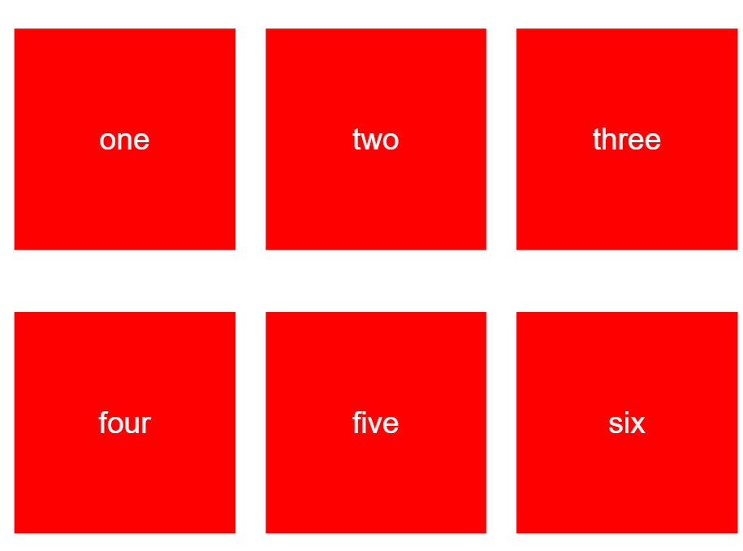

# react-native-square-grid
A component for rendering a grid of squares that perfectly fill your space (potentially with scrolling)

```
npm install --save react-native-square-grid
```

```
import SquareGrid from "react-native-square-grid";
```

## API

`<SquareGrid columns={number} rows={number} items={array<any>} renderItem={fn(item, index)} />`

 - `columns` is the number of columns your grid should have
 - `rows` is the number of rows your grid should have. If you set rows to `false` or `0`, it will render as many items as it can and scroll
 - `items` is an array of the contents you want for the grid. If the number of items is greater than the rows and columns allow, they will be ignored. (Unless scrolling is enabled)
 - `renderItem` is a function taking an item and an index, and returning a React node to fill the grid item with

## Example



```javascript
import React, {Component} from "react";
import {
	View,
	StyleSheet,
	Text,
} from "react-native";
import SquareGrid from "react-native-square-grid";

var NUMBERS = [
	"one",
	"two",
	"three",
	"four",
	"five",
	"six"
];

var styles = StyleSheet.create({
	item: {
		flex: 1,
		alignSelf: "stretch",
		padding: 16
	},
	content: {
		flex: 1,
		backgroundColor: "red",
		alignItems: "center",
		justifyContent: "center"
	},
	text: {
		color: "white",
		fontSize: 32
	}
});


// Best viewed in landscape
export default function SquareGridExample(props){
	return (
		<SquareGrid rows={2} columns={3} items={NUMBERS} renderItem={renderItem} />
	);
}

function renderItem(item) {
	return (
		<View style={styles.item}>
			<View style={styles.content}>
				<Text style={styles.text}>{item}</Text>
			</View>
		</View>
	);
}
```

## Running the example

There is an example project you can run which support orientation changes.
You can view the browser version [here](http://ranger.mauve.moe/react-native-square-grid/example/SquareGridExample/build/)

- clone this repo
- cd into `example/SquareGridExample`
- run `npm install`
- run `npm run setup` to copy the library code into the project
- Run in Android or iOS using your usual react-native approach
	- `npm start`
	- `react-native run-android`
	- or `react-native` run-ios
- Run in the browser using [react-native-web](https://github.com/necolas/react-native-web)
	- `npm run start-web`
